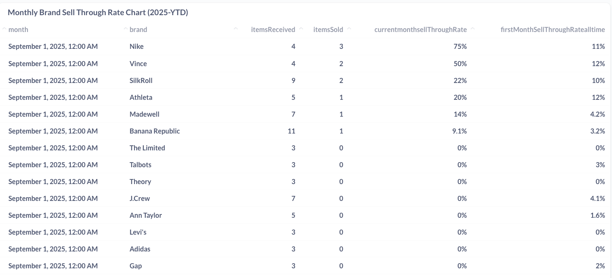
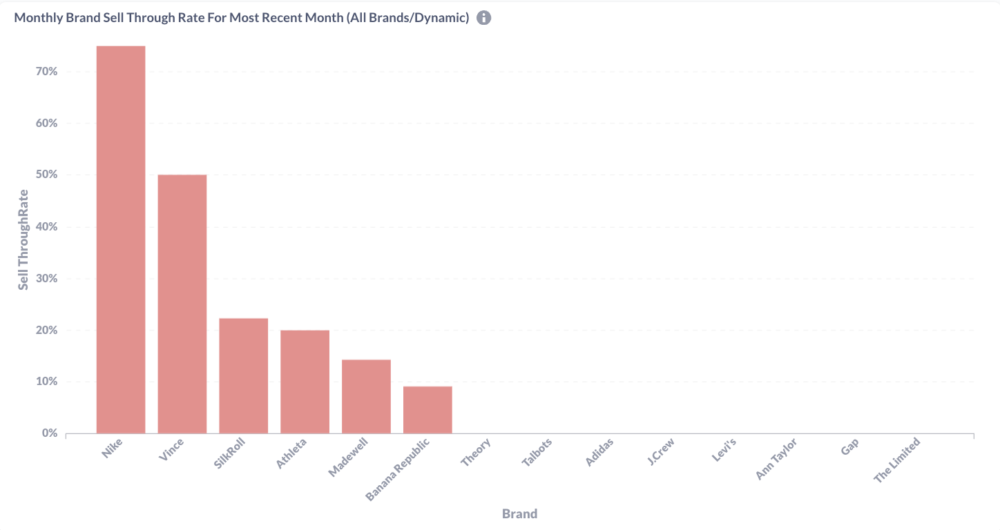
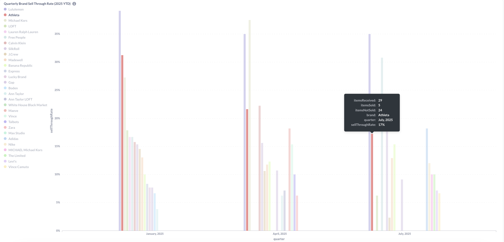
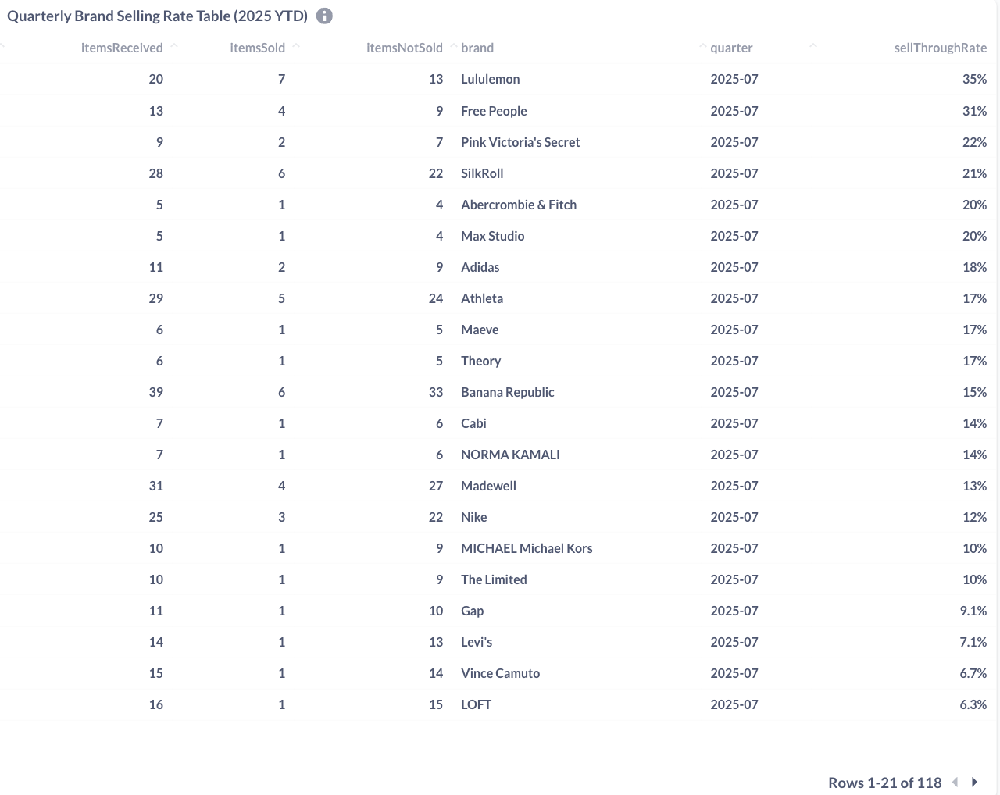
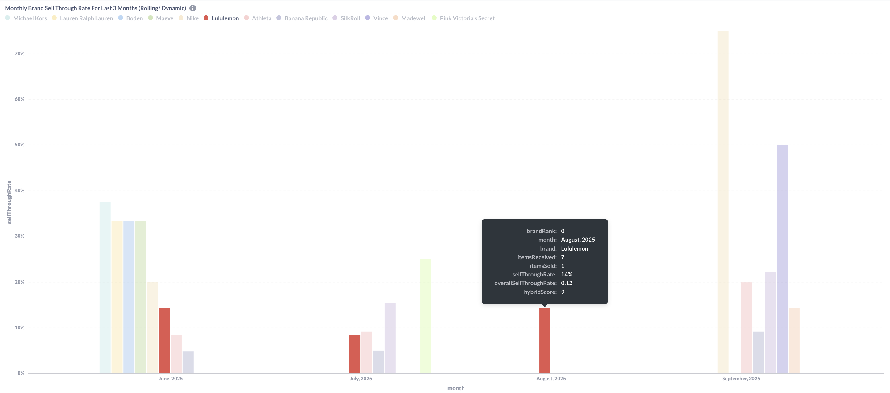
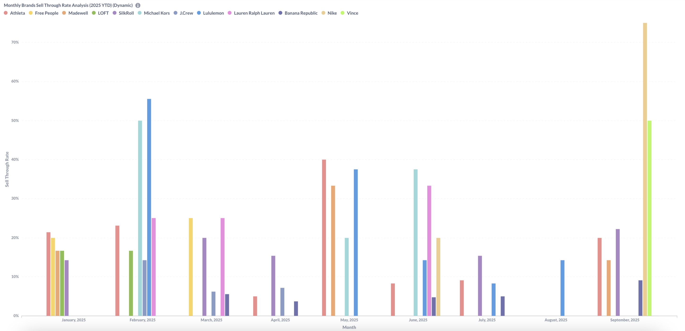
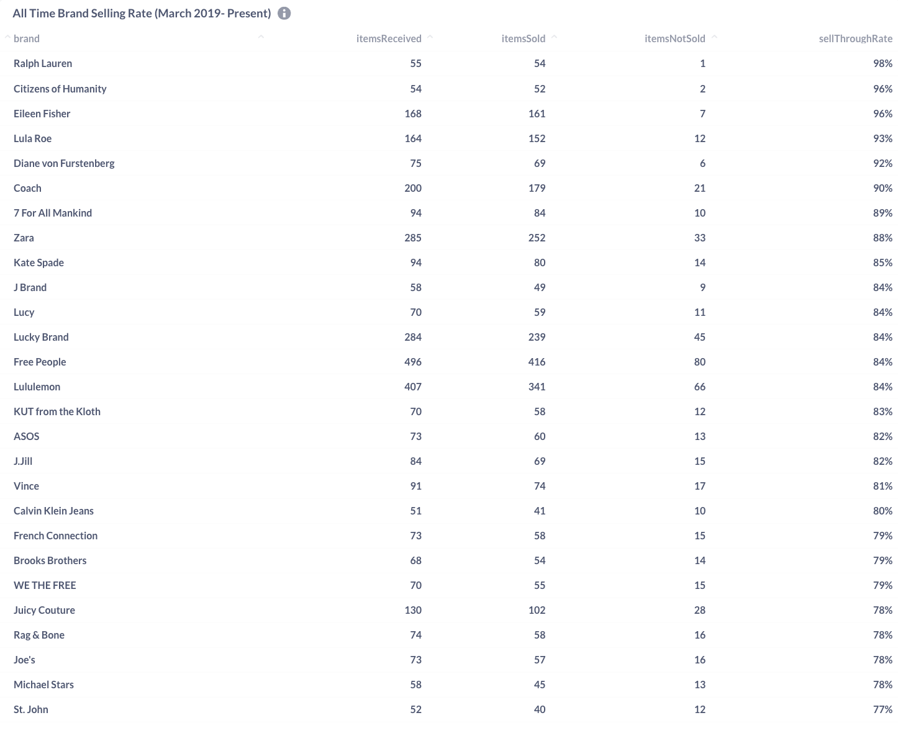

## Retail Analytics Internship - Brand Sell-Through Rate Analysis

**Developed comprehensive brand performance tracking system using Mongo DB and Metabase to optimize inventory management and identify top-performing brands across multiple time periods.**

---

# Project Overview

### **Business Problem**
The business needs to understand which brands were selling through inventory effectively and identify patterns in brand performance to optimize buying decisions and inventory allocation.

### **My Role & Tools**
- Built automated dashboards in Metabase
- Wrote SQL queries to calculate sell-through rates
- Created dynamic visualizations for different time periods
- **Tools:** Metabase, SQL, PostgreSQL

---

# Key Metrics & Analysis

### **Dashboard 1: Monthly Brand Sell-Through Rate**

This dashboard tracks monthly brand performance, showing both current month sell-through rates and historical trends. The data reveals that **Nike achieved the highest sell-through rate at 75%** in September 2025, while many premium brands like **Levi's, Adidas, and Gap showed 0% sell-through**, indicating potential overstock or seasonal demand issues.

### **Monthly Brand Performance Insights:**

- **Nike dominance:** 75% sell-through rate established Nike as top performer in September 2025
- **Athleta strong secondary:** 20% sell-through rate positioned Athleta as second-highest performing brand
- **Inventory challenges:** Multiple brands with 0% sell-through indicating potential overstock or demand misalignment
- **Performance gap:** Significant disparity between top performers and zero-conversion brands suggests need for selective inventory curation

---

### **Dashboard 2: Quarterly Brand Performance**

Quarterly analysis reveals seasonal trends, with **Lululemon showing consistently strong performance (~35% sell-through)** across quarters, while athletic brands like Athleta showed more volatility between quarters.

### **Quarterly Brand Performance Insights:**

- **Consistent performers:** Lululemon maintained strong quarterly results throughout 2025
- **Seasonal variation:** Clear differences in brand performance across Q1, Q2, and Q3
- **Athletic brand dominance:** Athletic brands consistently lead top-performing categories
- **Athleta volatility:** Despite strong 17% sell-through in July 2025, Athleta shows quarterly fluctuation with several percentage point variations from peak performance

---

### **Dashboard 3: Rolling 3-Month Brand Trends**

The rolling 3-month view provides a different perspective from the quarterly analysis above - **this tracks monthly sell-through rates for inventory received and sold within the same month**, while the quarterly dashboard shows sell-through rates for inventory received and sold within a 3-month period. This monthly view helps identify immediate sales velocity vs. sustained quarterly performance.

**Key Insight:** **Lululemon consistently achieves strong same-month sell-through rates** (~10% in June, July, and August 2025), demonstrating immediate sales velocity. However, **Lululemon shows a decline in September 2025**, with no sales, suggesting potential inventory, demand challenges or shifting market trends. **Other brands show inconsistent patterns**, such as Michael Kors achieving a strong 40% sell-through rate in June (visible as the first bar) but disappearing from subsequent months, indicating sporadic inventory cycles or seasonal demand fluctuations.

### **Technical Features:**
- **Interactive tooltips** with detailed brand metrics including hybrid scores
- **Same-month sell-through tracking** vs. quarterly cumulative rates
- **Hybrid scoring system** combining multiple performance indicators
- **Monthly trend analysis** for immediate sales velocity assessment

---

### **Dashboard 4: Historical Brand Performance**

**Historical vs. Recent Performance Analysis**

Long-term brand performance analysis from March 2019 to present reveals **premium brands dominate lifetime sell-through rates**, with Ralph Lauren (98%) and Citizens of Humanity (96%) leading the market. However, comparing this historical data with recent monthly performance (2025 YTD) shows significant shifts in brand dynamics and market positioning.

### **All-Time Performance Leaders (March 2019-Present):**
- **Ralph Lauren:** 98% lifetime sell-through (55 received, 54 sold)
- **Citizens of Humanity:** 96% performance (54 received, 52 sold)
- **Eileen Fisher:** 96% with higher volume (168 received, 161 sold)
- **Lululemon:** 84% lifetime rate (407 received, 341 sold) - notable for high volume

### **Recent Monthly Trends vs. Historical Performance:**
- **Vince** emerges as a standout in September 2025 (50% monthly rate) despite moderate 81% lifetime performance, suggesting recent strategic improvements
- **Lululemon** shows disconnect between strong lifetime performance (84%) and recent monthly volatility, including zero sales in September 2025
- **Premium brands** like Ralph Lauren and Citizens of Humanity rarely appear in recent monthly data.
  
### **Key Strategic Insights:**
- **Volume vs. Efficiency Trade-off:** High-volume brands (Lululemon: 407 items, Free People: 496 items) maintain solid but not exceptional lifetime rates (84%), while low-volume premium brands achieve near-perfect sell-through
- **Market Evolution:** Recent monthly leaders (Vince, Michael Kors) don't align with lifetime top performers, suggesting changing consumer preferences or improved brand strategies
- **Inventory Management:** Premium brands' limited recent activity may indicate more strategic, seasonal inventory planning compared to fast-fashion continuous restocking

# Key Business Insights

### **Performance Patterns Identified:**
- **Athletic/wellness brands** (Nike, Athleta, Lululemon) consistently outperform traditional fashion brands
- **Seasonal trends** - certain brands perform significantly better in specific quarters
- **Premium brands** demonstrate higher historical sell-through rates but with lower volume
- **Zero sell-through rates** for multiple brands in recent months indicated critical inventory management issues

### **Business Impact & Recommendations:**
- **Inventory Optimization:** Recommended increasing allocation for consistently high-performing brands (Nike, Lululemon)
- **Promotional Strategy:** Suggested targeted promotions for brands with low sell-through rates
- **Pricing Analysis:** Identified opportunity to analyze pricing strategy for zero sell-through brands
- **Seasonal Planning:** Provided data-driven insights for quarterly buying decisions

---

# Technical Implementation

### **Dashboard Features:**
- **Real-time data refresh** from retail database
- **Interactive filtering** by time period, brand, and performance metrics
- **Drill-down capabilities** from quarterly to monthly to daily views
- **Custom KPI calculations** including hybrid performance scores

### **Data Engineering Challenge**
- **Data Sources:** Products collection and Orders collection in MongoDB  
- **Key Challenge:** Matching product SKUs received in a time period with orders sold in the same period
- **Solution:** Built complex MongoDB aggregation pipeline with $lookup to join inventory and sales data
- **Custom Logic:** Created quarter calculation using $dateFromParts for flexible time period analysis
- **Data Quality:** Applied minimum threshold filters (5+ items) to ensure statistical significance