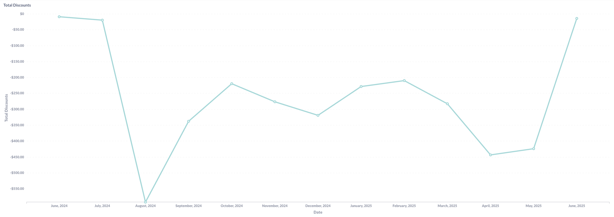
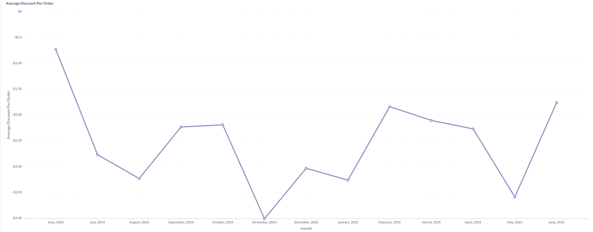
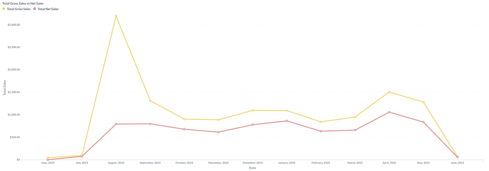
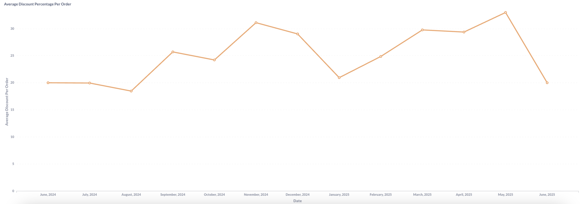

**Discount Strategy & Revenue Impact Analysis**

## Total Discount Trends 

The discount analytics reveal significant patterns in cash transaction pricing strategy and its impact on revenue generation. With both point-based and cash payment options, discount management becomes critical for optimizing cash flow while maintaining competitive positioning.

**Total Discount Trends:**
Peak discount periods show $550 in total discounts (August 2024) coinciding with highest gross sales activity ($3,000+), indicating promotional campaigns successfully drive cash transaction volume. However, recent months show declining discount activity, suggesting either strategic pricing changes or reduced promotional intensity.

## Average Discount Patterns 

**Average Discount Patterns:**
Per-order discounts range from $0.75 to $3.50, representing 18-35% discount rates. The February 2025 peak ($1.80 average, ~29% discount rate) demonstrates aggressive promotional pricing, while recent stabilization around $1.80-$2.30 suggests optimized discount levels for sustained profitability.

## Gross vs Net Sales

**Revenue Impact Analysis:**
The gross vs. net sales gap reveals substantial revenue impact from discount strategy. Peak periods show $500-800 revenue reduction from discounts, representing 15-25% of gross sales lost to promotional pricing. Recent months maintain more sustainable 10-15% discount impact ratios.

**Average Discount Percentage Analysis:**

The discount percentage trends reveal strategic pricing evolution and promotional intensity across the hybrid marketplace. Percentage analysis shows discount rates ranging from 18% to 35%, with distinct seasonal patterns that impact both cash transaction appeal and point-to-cash conversion strategies.

**Percentage Pattern Insights:**
Early periods maintained conservative 20% discount rates, escalating to aggressive 25-35% promotional pricing during peak activity months (September-November 2024). Recent stabilization around 30-35% suggests optimized discount levels that balance customer acquisition with profitability in the dual-payment ecosystem.

**Strategic Percentage Implications:**
Higher percentage discounts (30%+) likely drive customer preference toward cash payments over point usage, directly benefiting the 2% transaction fee revenue model. However, sustained high percentage discounts may create customer expectation for promotional pricing, potentially reducing full-price cash transaction willingness.

### **Optimization Opportunities:**
- **Test percentage thresholds** that maximize cash preference without eroding margins
- **Seasonal percentage strategies** based on point inventory and cash flow needs

### **Strategic Implications:**
- **Dual-economy balance:** Cash discounts must compete with point-based "free" alternatives
- **Transaction fee optimization:** 2% fees on discounted items reduce actual commission revenue
- **Customer channel preference:** Aggressive cash discounts may cannibalize point usage
- **Promotional effectiveness:** High discount periods correlate with volume spikes but impact net profitability

### **Revenue Optimization Opportunities:**
- Test discount thresholds that drive cash preference over point usage
- Implement dynamic pricing based on point inventory levels
- Optimize discount timing to maximize 2% transaction fee generation
- Balance promotional intensity with sustainable profit margins