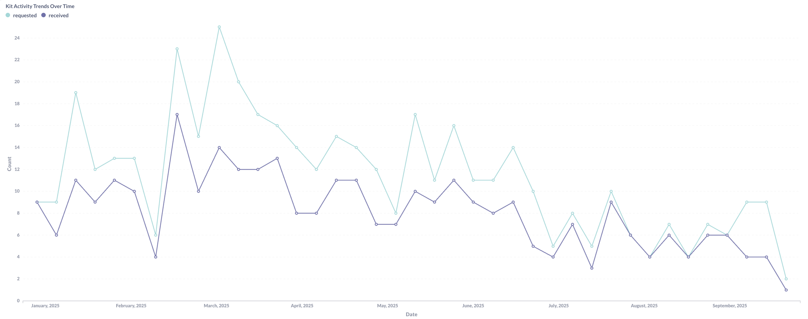
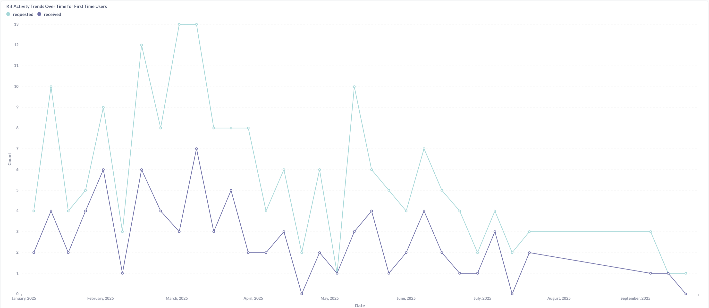
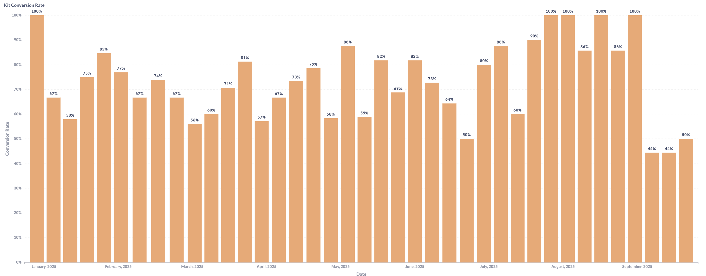
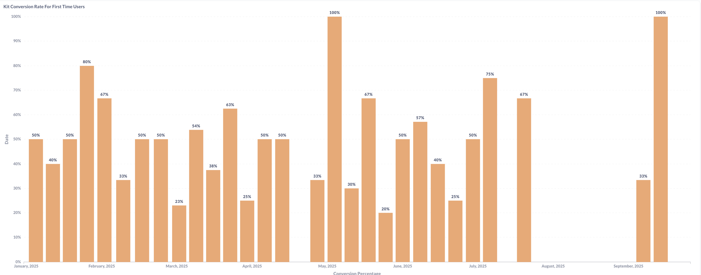
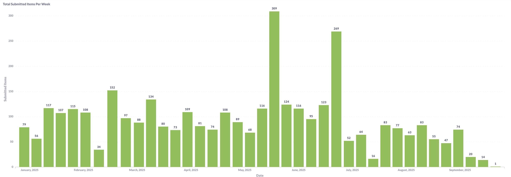
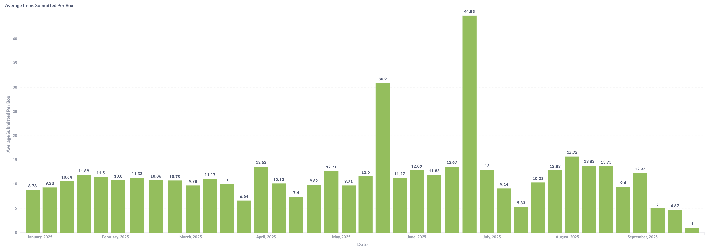
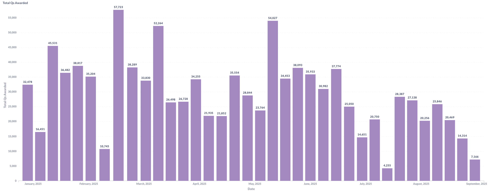
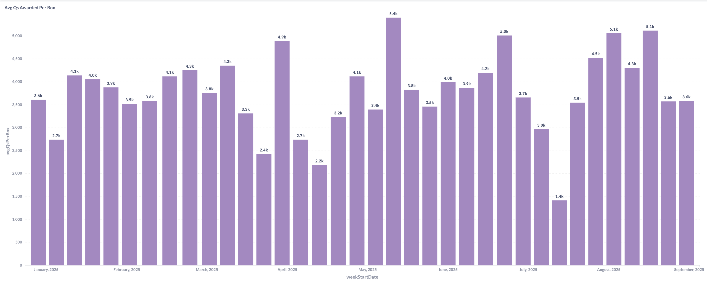
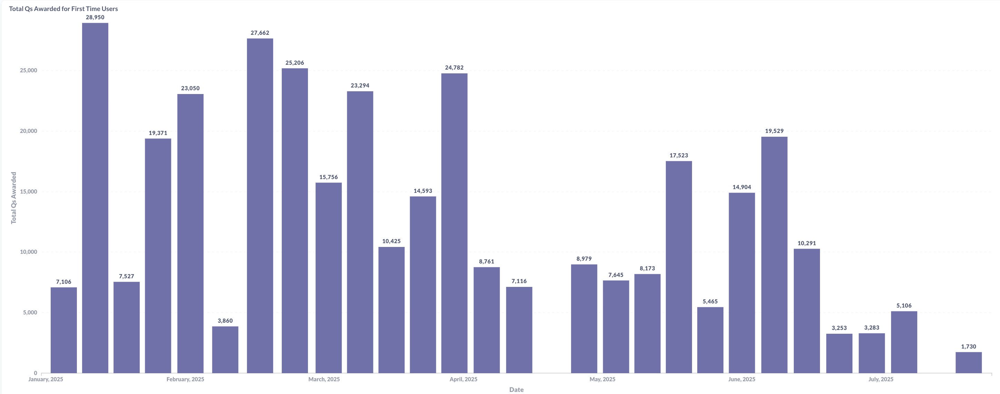
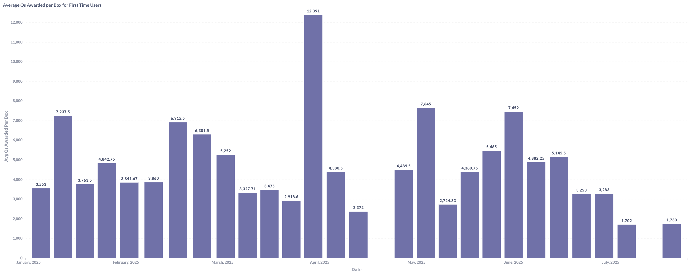

## Kit Processing & Customer Acquisition Analysis

**Developed comprehensive kit analytics system to track customer submissions, conversion rates, and points distribution in the fashion resale business model.**

---

# Project Overview

### **Business Context**
This dashboard tracks the core supply-side of the circular fashion platform - the customer kit request and shipment funnel that generates the inventory pool. Customers request shipping labels for clothing kits to earn points, making the request-to-shipment conversion rate and processing efficiency critical business metrics.

### **Key Metrics Tracked**
- **Kit request vs. actual shipment rates** (overall and first-time users)
- **Weekly submission volumes** and seasonal trends
- **Points awarded per kit** and total points distribution
- **First-time user behavior** compared to repeat customers

# Kit Request & Conversion Funnel Analysis

### Kit Activity Trends Over Time (2025 YTD)

{width=100% height=400px}

### Kit Activity Trends for First Time Users (2025 YTD)

{width=100% height=400px}

**Activity Analysis:**

Kit request activity shows concerning decline from 24 requests per week in early 2025 to near-zero by mid-year, indicating significant customer acquisition challenges. First-time users display more volatile patterns with requests ranging from 0-13 per week, suggesting new user hesitation and the critical importance of first-impression optimization.

---

### **Conversion Rate Performance**

### Kit Conversion Rate (2025 YTD)

{width=100% height=400px}

### Kit Conversion Rate for First Time Users (2025 YTD)

{width=100% height=400px}

**Conversion Analysis:**

Conversion rates remain exceptionally strong at 80-100% among those who request kits, demonstrating that the shipping process and user experience effectively convert intent into action. First-time users show conversion rates fluctuating between 20-100%, averaging 50-67% - while facing more friction, the majority who request labels do follow through with shipments.

**Strategic Funnel Insights:**
- **Top-of-funnel crisis:** Dramatic request decline requires immediate customer acquisition intervention
- **Conversion excellence:** 80-100% follow-through validates shipping process and user experience quality
- **New user friction points:** Variable conversion rates (20-100%) indicate inconsistent first-time experience
- **Intent-to-action gap:** Strong conversion among requesters suggests the barrier is awareness, not process complexity
---

# Submission Volume & Activity Analysis

### Total Submitted Items Per Week (2025 YTD)

{width=100% height=400px}

### Average Items Submitted Per Box (2025 YTD)

{width=100% height=400px}

**Volume Pattern Analysis:**

Submission volumes demonstrate significant volatility with peak activity reaching 309 items in a single week, while recent periods show dramatic decline to single-digit submissions. This extreme variability correlates with the declining request patterns, confirming supply-side challenges extend through the entire funnel.

Average items per box fluctuate between 5-45 items, with the extreme 45-item outlier likely representing bulk or special submissions. Excluding outliers, the typical range of 8-13 items per box suggests consistent member behavior in terms of what constitutes a "full" submission, providing operational predictability for processing capacity planning.

### **Operational Insights:**
- **Peak capacity validated:** 309 items/week processed successfully demonstrates operational scalability
- **Recent volume crisis:** Decline to 1-20 items/week indicates urgent need for supply generation initiatives
- **Box size consistency:** 8-13 item average enables accurate processing time and point allocation forecasting
- **Seasonal patterns evident:** Volume spikes in specific periods suggest opportunity for targeted campaigns

---
# Points Distribution Strategy Analysis

### **Overall Points Distribution**

### Total Points Awarded (2025 YTD)

{width=100% height=400px}

### Average Points Awarded Per Box (2025 YTD)

{width=100% height=400px}

**Overall Points Analysis:**

Overall points distribution shows substantial variation with peak weeks awarding 52,000+ total points while average per-box awards range from 2,400 to 5,000 points. This consistency in per-box averages (despite total volume fluctuations) suggests standardized quality assessment algorithms rather than arbitrary point allocation. The stable per-box metrics enable predictable member value communication and operational forecasting.

---

### **First-Time User Points Strategy**

### Total Points Awarded for First Time Users (2025 YTD)

{width=100% height=400px}

### Average Points Awarded per Box for First Time Users (2025 YTD)

{width=100% height=400px}

**First-Time User Points Analysis:**

First-time user points reveal aggressive acquisition strategy with average awards of 7,000-13,000 points per box - significantly higher than the 3,600-4,500 overall average. Peak first-time user awards reached 27,662 total points in single weeks with individual boxes earning up to 13,391 points, demonstrating substantial investment in new user acquisition through premium point bonuses.

### **Points Strategy Insights:**
- **Acquisition investment:** First-time users receive 2-3x standard points, indicating strategic prioritization of new member onboarding
- **Quality consistency:** Stable per-box averages suggest effective item valuation algorithms
- **Total distribution volatility:** Wide swings (4,000-52,000) reflect volume fluctuations rather than valuation changes
- **Retention opportunity:** Standard 3,600-4,500 point average may be insufficient to maintain engagement after initial bonus period

### **Strategic Implications:**
- **New user incentive effectiveness:** Higher points successfully drive first-time participation but may create unrealistic expectations
- **Point economy sustainability:** Aggressive first-time bonuses require careful balance against platform economics
- **Value proposition clarity:** Consistent per-box awards enable predictable member value communication
- **Retention risk:** Dramatic drop from first-time bonuses (13k) to standard rates (4k) may impact repeat behavior

---

# Strategic Business Recommendations

### **Customer Acquisition Crisis Response:**
- **Immediate intervention required:** Request decline from 24 to near-0 threatens supply chain viability
- **Marketing campaign intensification:** Leverage 80-100% conversion rate as social proof in acquisition messaging
- **Channel diversification:** Expand beyond current acquisition channels to reach new member segments
- **Referral program optimization:** Strong conversion rates suggest existing members could effectively recruit peers

### **First-Time User Experience Optimization:**
- **Onboarding refinement:** Address 20-100% conversion volatility through clearer instructions and expectation setting
- **Shipping support enhancement:** Provide more guidance during critical first-shipment period
- **Point expectation management:** Communicate standard vs. bonus point structures to reduce retention shock
- **Success stories amplification:** Showcase typical member experiences to normalize process and outcomes

### **Supply Chain Sustainability:**
- **Volume stabilization initiatives:** Develop consistent acquisition campaigns to smooth submission volatility
- **Seasonal campaign planning:** Capitalize on identified peak periods with targeted promotional efforts
- **Processing efficiency maintenance:** Preserve 309-item peak capacity for future growth scenarios
- **Box size optimization:** Standardize around 8-13 item optimal range for operational predictability

### **Points Economy Management:**
- **Acquisition cost analysis:** Evaluate ROI of 2-3x first-time user point bonuses against lifetime value
- **Retention incentive testing:** Implement mid-tier loyalty bonuses to bridge first-time and standard rates
- **Dynamic point allocation:** Consider item-quality based adjustments while maintaining average consistency
- **Point inflation monitoring:** Ensure bonus structures remain sustainable as platform scales

---

# Technical Implementation

### **Data Engineering:**
- **Cross-platform funnel tracking:** Kit requests → shipping labels → actual shipments → points awarded
- **Customer segmentation:** First-time vs. repeat user behavioral analysis across all funnel stages
- **Time-series analysis:** Weekly, monthly, and seasonal trend identification for pattern recognition
- **Conversion pipeline optimization:** Real-time tracking of request-to-ship-to-process-to-points flow

### **Key Calculations:**
- **Conversion rates:** (Shipped Kits / Requested Kits) × 100 across customer segments and time periods
- **Points per item algorithms:** Quality-based valuation system with new user bonus multipliers
- **Volume forecasting:** Historical pattern analysis for capacity planning and campaign timing
- **Customer lifetime value:** Tracking from first kit request through multiple shipments over time

---

# Results & Impact

### **Supply Chain Intelligence:**
- **Critical decline identified:** 2025 request drop from 24 to near-0 enables proactive intervention
- **Process validation:** 80-100% conversion rate confirms operational excellence in shipping experience
- **Acquisition cost quantified:** First-time user point premium (7k-13k vs 3.6k-4.5k) provides clear investment metrics
- **Capacity baseline established:** 309-item peak week validates scalability for future growth

### **Strategic Outcomes:**
- **Funnel optimization roadmap:** Clear intervention points identified across request, shipment, and retention stages
- **Customer education priorities:** First-time user friction points isolated for targeted improvement
- **Points economy framework:** Data-driven approach to balancing acquisition incentives with sustainability
- **Seasonal planning intelligence:** Historical patterns enable strategic campaign timing and resource allocation

**Business Impact:**
- **Acquisition strategy framework:** Evidence-based approach to reversing request decline trends
- **Retention program design:** Gap analysis between first-time bonuses and standard rates informs loyalty initiatives
- **Operational confidence:** Proven processing capacity supports aggressive growth planning
- **Value proposition validation:** Consistent per-box points enable predictable member communication and marketing

---

*This kit analytics system provides essential supply-side intelligence for optimizing the circular fashion platform's customer acquisition funnel and inventory generation process.*