## Revenue & Customer Behavior Analysis

**Built comprehensive analytics dashboards to track dual payment system performance, analyzing how customers use points (earned from clothing kits) versus cash payments in the circular fashion marketplace.**

---

# Project Overview

### **Business Context**

This circular fashion platform operates on a unique dual-payment model that balances sustainability with revenue generation:

**Points System:**
- Members consign clothing kits to the platform and earn points based on item quality and type
- Points can be used to "purchase" items from other members' consigned inventory
- The platform charges a 2% service fee on the point value of transactions
- Points create a closed-loop economy encouraging continued participation in the circular fashion model

**Cash System:**
- Members can also purchase items directly with cash payments
- Cash transactions also incur the 2% platform service fee
- Cash option provides accessibility for new users and generates direct revenue

**Hybrid Model:**
- Some transactions combine both points and cash
- Enables members to supplement point balances with cash for higher-value items
- Creates flexibility in the marketplace

Understanding the balance between these payment methods is crucial for business sustainability, inventory health, and pricing strategy. The analytics below reveal how members interact with this dual-economy system.

---

# Revenue Overview Analysis

### Total Revenue For All Orders + Fee (2025 YTD)

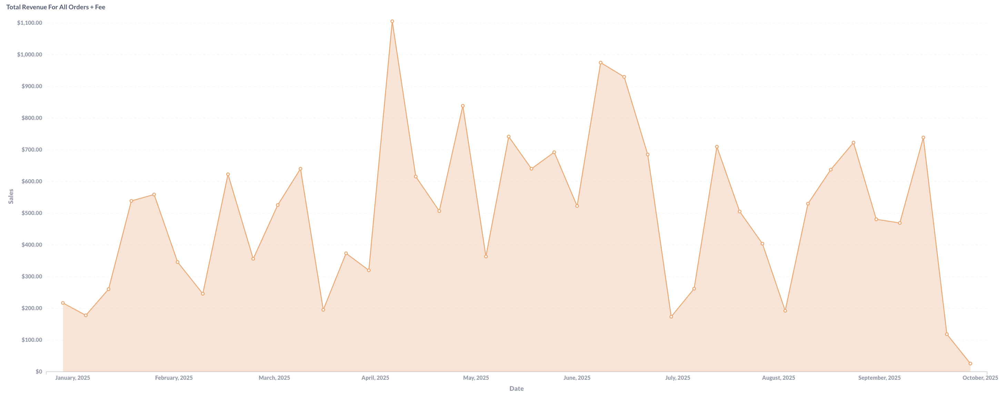{width=90% height=400px}

### Average Revenue Per Order (2025 YTD)

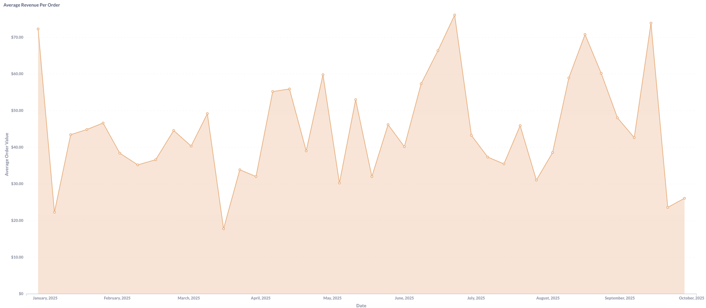{width=100% height=400px}

**Overall Revenue Performance:**

Total revenue demonstrates significant volatility throughout 2025, with peak performance reaching $1,100+ in early periods before declining to $100-200 ranges by late year. This dramatic decline correlates with the previously identified kit submission crisis, as reduced inventory intake directly impacts available purchase options and transaction volume.

Average revenue per order shows more stability, ranging from $20-70+ throughout the year with notable spikes to $75+ during peak performance periods. The consistency in per-order values despite total revenue fluctuations suggests pricing remains stable, with volume decline being the primary revenue challenge rather than average transaction value erosion.

---

# Payment Method Revenue Comparison

### Total Revenue From Points Items (2025 YTD)

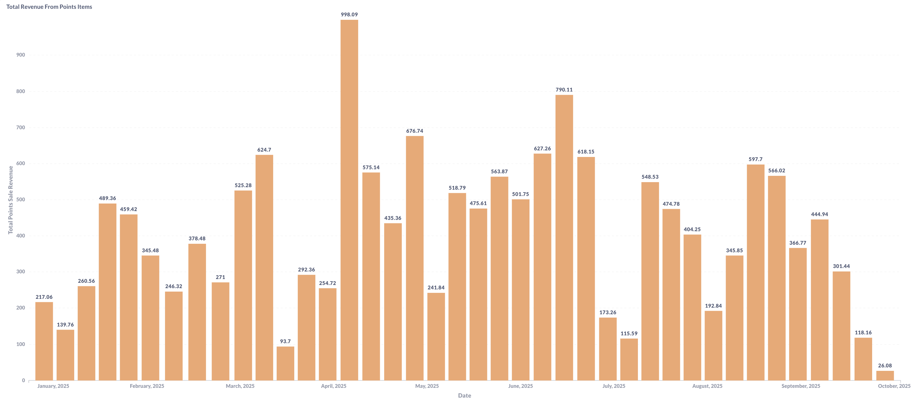{width=90% height=400px}

### Total Revenue From Cash Sales (2025 YTD)

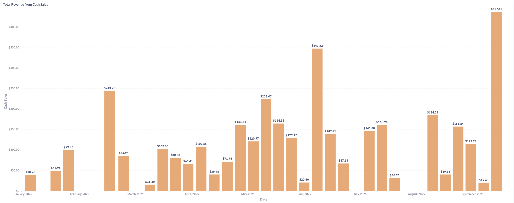{width=90% height=400px}

**Points vs. Cash Revenue Analysis:**

Points-based revenue shows dramatic peaks reaching $998 maximum with consistent $400-600 ranges during active periods, significantly outperforming cash revenue throughout most of 2025. The volatility in points revenue reflects the supply-driven nature of the platform - when quality inventory is available through kit submissions, points transactions surge.

Cash revenue demonstrates more modest but steadier performance, with peaks reaching $437 and typical ranges of $100-250. The recent late-2025 surge in cash revenue ($437 peak) while points revenue declines suggests potential behavioral shift - members may be purchasing remaining inventory with cash as point-earning opportunities diminish due to reduced kit submissions.

### **Strategic Implications:**
- Peaks reaching $998 with consistent $400-600 active period performance
- 2-3x higher revenue generation than cash during healthy inventory periods
- Volatility reflects supply-driven marketplace nature

---

# Purchase Volume Analysis

### Total Items Bought with Points (2025 YTD)

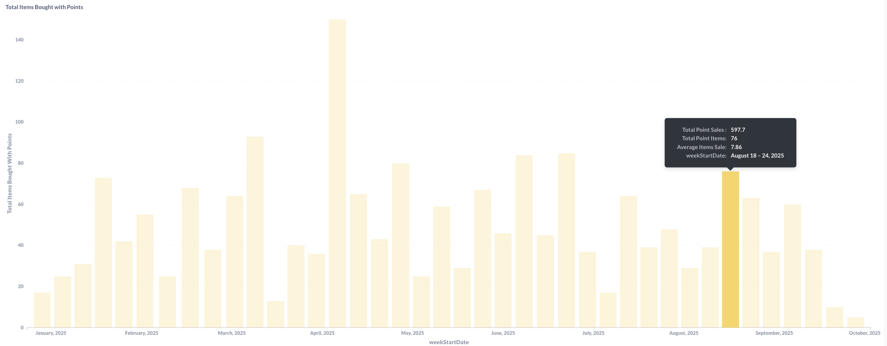{width=90% height=400px}

### Total Items Bought With Cash (2025 YTD)

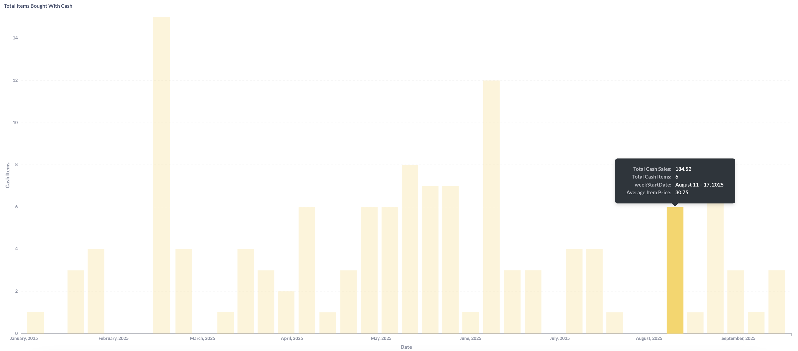{width=90% height=400px}

### Average Revenue From Items Bought with Points (2025 YTD)

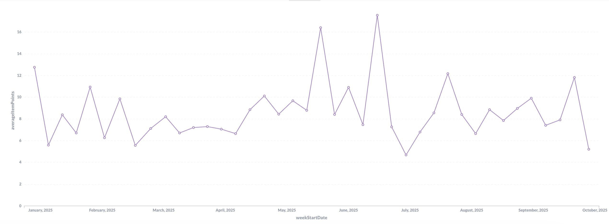{width=90% height=400px}

### Average Cash Item Value (2025 YTD)

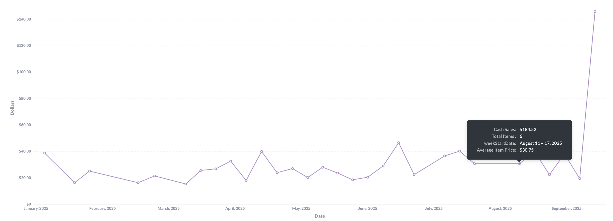{width=90% height=400px}

**Volume and Pricing Pattern Analysis:**

Points-driven purchases demonstrate dramatically higher volume with peaks reaching 147 items per week, while cash purchases max at 14 items - approximately a 10:1 ratio. This massive volume differential confirms the points system as the primary driver of marketplace activity and member engagement.

Average item values reveal interesting pricing dynamics. Points items maintain relatively consistent $5-17 valuations throughout the year, while cash items show more volatility with occasional spikes to $140+ (likely premium or bulk purchases). The stability in points pricing suggests standardized valuation algorithms, while cash pricing reflects more market-driven dynamics.

### **Key Insights:**
- Points system drives 90%+ of transaction volume
- Consistent points pricing ($8-15 average) enables predictable member value communication
- Cash transactions serve niche role for premium items or new member accessibility
- Volume decline (147 to near-0 items) represents existential supply chain crisis

---

# Order Behavior & Service Fee Analysis

### Unique Orders vs Items Sold (2025 YTD)

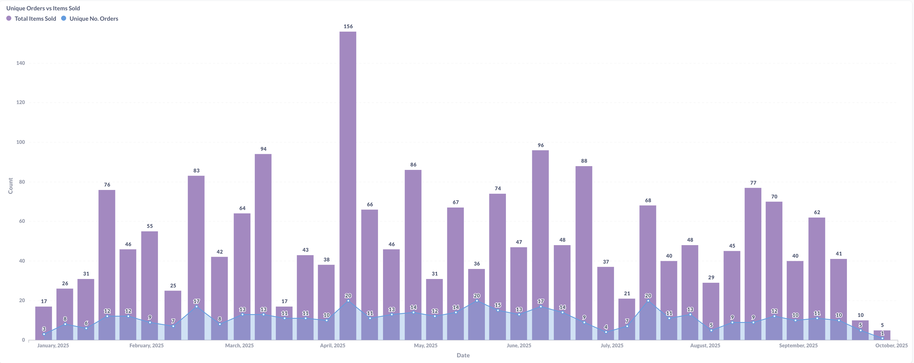{width=90% height=400px}

### Item Service Fees by Payment Type (2025 YTD)

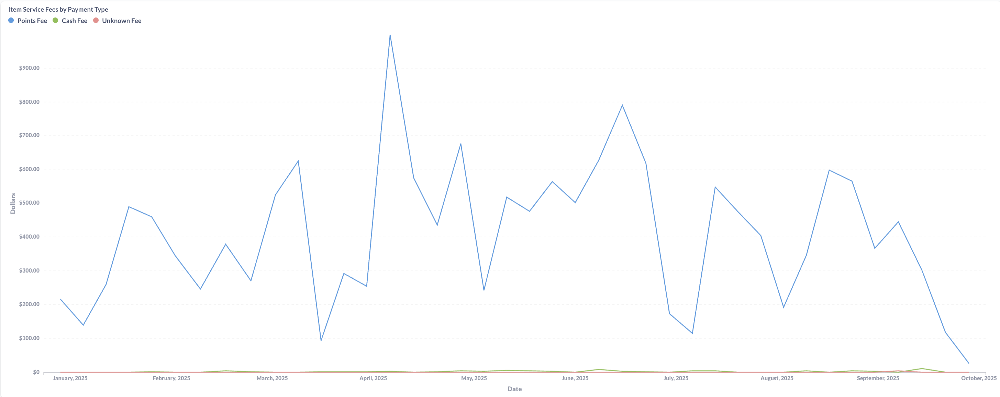{width=90% height=400px}

### Orders Purchased with Points Weekly (2025 YTD)

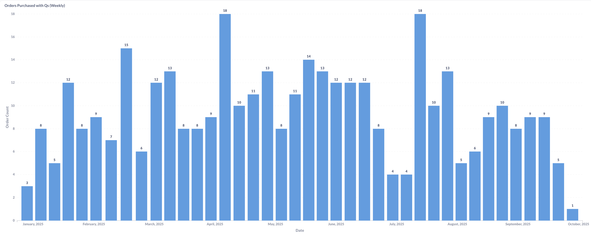{width=90% height=400px}

### Average Items Per Order (2025 YTD)

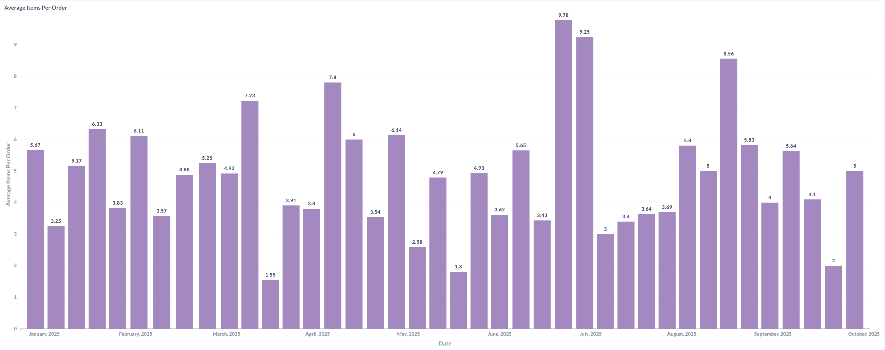{width=90% height=400px}

**Order Pattern Analysis:**

Unique order tracking reveals peak activity of 156 orders with 94 items sold, indicating some multi-item orders but relatively low basket sizes. The declining pattern from 80+ weekly orders to single digits by late 2025 mirrors the broader supply chain challenges identified in kit submission analysis.

Service fee revenue demonstrates the business model's effectiveness, with points fees generating $900+ peaks significantly outperforming cash fees ($100-300 ranges). The 2% fee structure on high-volume points transactions proves substantially more profitable than low-volume cash fees, validating the platform's strategic focus on the circular economy model.

Weekly points purchase patterns show consistency in the 8-18 order range during healthy periods, demonstrating strong member retention and engagement. Average items per order fluctuate between 2-9 items, with the variance suggesting different member purchase behaviors - some single-item targeted purchases versus others browsing for multiple items.

### **Operational Insights:**
- Service fees from points transactions are primary revenue driver ($900+ peaks)
- Weekly order consistency (8-18) during healthy periods validates retention strategies  
- Multi-item orders (3-9 average) suggest healthy browsing and discovery behavior
- Recent decline to 1-5 weekly orders indicates critical engagement crisis

---

# Points Economy Analysis

### Total Points Spent (2025 YTD)

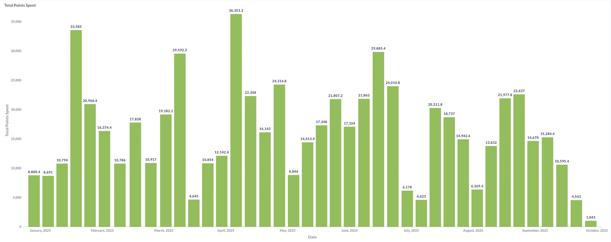{width=90% height=400px}

### Average Points Spent Per Order (2025 YTD)

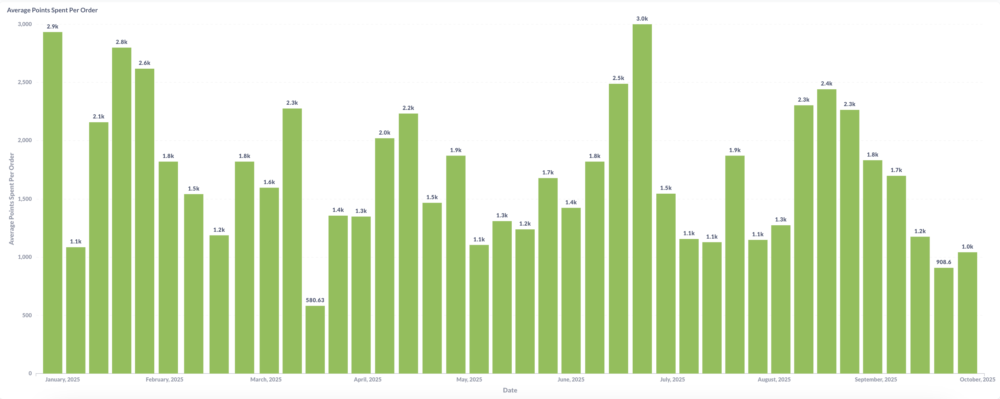{width=90% height=400px}

### Total Revenue by Order Type (2025 YTD)

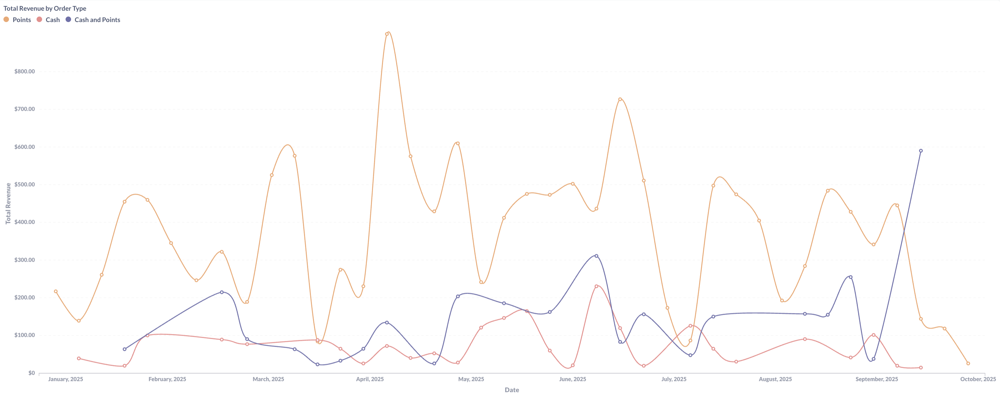{width=90% height=400px}

### Fee Revenue By Order Type (2025 YTD)

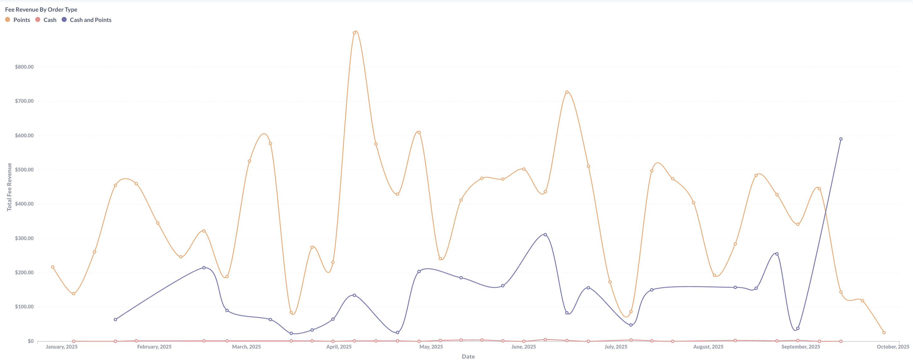{width=90% height=400px}

**Points Distribution and Revenue Analysis:**

Total points spent shows significant weekly variation with peaks reaching 36,353 points, demonstrating robust point circulation during healthy marketplace periods. The consistent presence of 15,000-30,000 weekly point expenditure through mid-2025 indicates strong member engagement with the circular economy model before recent decline.

Average points per order maintains remarkable consistency at 1,500-3,000 points (approximately 1.5k-3k), suggesting standardized pricing tiers and predictable member purchasing behavior. This stability enables accurate revenue forecasting and member value communication.

Revenue breakdown by order type confirms points transactions (orange line) dominate total revenue, consistently generating $400-800 while cash (blue) and hybrid (purple) transactions contribute $50-300 ranges. The convergence of all three lines at lower levels in recent periods indicates across-the-board marketplace decline rather than payment method substitution.

Fee revenue analysis reinforces points transactions as the business model's foundation, with points fees generating $400-900 peaks versus cash fees' $50-150 ranges. The minimal hybrid transaction fees suggest limited adoption of combined payment methods.

### **Strategic Points Economy Insights:**
- Points circulation remains healthy when inventory is available (36k+ weekly spending)
- Consistent per-order point usage (1.5k-3k) enables predictable member experience
- Points-based service fees generate 85-90% of platform revenue
- Recent points spending decline to 4,000-10,000 weekly reflects supply constraints

---

# Payment Method Preference Analysis

### Number of Orders by Type (2025 YTD)

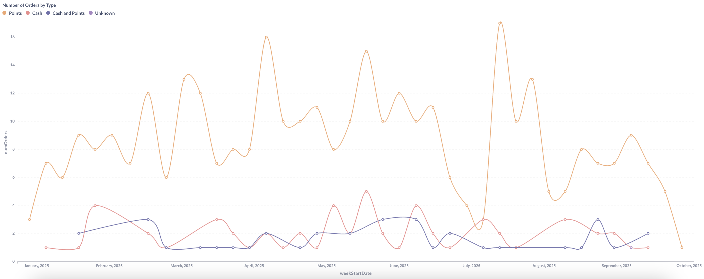{width=100% height=400px}

**Member Payment Behavior Patterns:**

Order type distribution reveals overwhelming preference for points-only transactions (orange line), consistently representing 8-17 weekly orders during healthy periods versus 1-4 cash orders (red) and 1-3 hybrid orders (blue/purple). This 3:1 to 8:1 ratio confirms the circular fashion model's success in driving member engagement through the points economy.

The minimal hybrid transaction adoption (1-3 orders weekly) suggests members view points and cash as distinct rather than complementary payment methods. This binary behavior indicates clear member segmentation - committed circular fashion participants using points versus occasional or new users purchasing with cash.

Recent convergence of all payment types at 0-2 weekly orders demonstrates system-wide activity decline rather than payment method migration, confirming the supply-side crisis as root cause rather than payment preference shifts.

### **Behavioral Insights:**
- Points-only transactions represent 70-80% of order volume during healthy periods
- Limited hybrid adoption suggests distinct member segments rather than blended behavior
- Cash maintains consistent 1-4 weekly orders serving accessibility function
- Recent decline affects all payment types equally, indicating supply-driven rather than preference-driven changes

---

# Strategic Business Recommendations

### **Immediate Priority: Supply Chain Recovery**
- **Critical intervention required:** All revenue metrics decline due to kit submission crisis identified in previous analysis
- **Points economy depends on inventory:** Without incoming kits, the circular model breaks down
- **Cross-functional impact:** Revenue, engagement, and service fees all tied to healthy inventory flow

### **Points System Optimization:**
- **Maintain current pricing consistency:** 1.5k-3k average points per order provides predictable member experience
- **Leverage 10:1 volume advantage:** Points transactions drive both engagement and revenue
- **Service fee model validation:** $900+ peaks from 2% points fees confirm business model effectiveness
- **Point circulation health monitoring:** 15k-30k weekly spending indicates healthy marketplace

### **Cash Transaction Strategy:**
- **Accessibility function confirmed:** 1-4 weekly cash orders serve new/occasional users
- **Premium item opportunity:** $140+ spikes suggest potential for high-value cash-only inventory
- **Complementary not competitive:** Cash transactions supplement rather than cannibalize points economy
- **Recent surge investigation:** Late-2025 cash revenue increase may indicate strategic opportunity

### **Revenue Diversification:**
- **Service fee optimization:** 2% model effective but consider tiered structure for high-value items
- **Hybrid transaction promotion:** Current low adoption (1-3 weekly) represents growth opportunity
- **Cash inventory curation:** Target premium items for cash-only sales to maximize revenue
- **Member segmentation:** Develop distinct strategies for points-committed vs. cash-preferring members

### **Member Engagement Programs:**
- **Retention focus:** 8-18 consistent weekly orders during healthy periods validates current strategies
- **Basket size optimization:** 3-9 items per order suggests room for discovery and bundling initiatives
- **Payment preference incentives:** Test promotions for hybrid transactions to increase adoption
- **Seasonal campaign timing:** Align promotions with identified kit submission and purchase patterns

---

# Technical Implementation

### **Data Engineering:**
- **Multi-payment tracking:** Complex aggregation across points, cash, and hybrid transaction types
- **Real-time service fee calculation:** Automated 2% fee computation across both payment methods
- **Points economy monitoring:** Circulation tracking, balance management, and inflation prevention
- **Cross-platform integration:** Orders, payments, inventory, and kit submission system coordination

### **Key Metrics Calculated:**
- **Points-to-cash conversion ratios:** Revenue equivalency and comparative performance analysis
- **Service fee optimization:** Payment type profitability and fee structure effectiveness
- **Customer lifetime value:** Segmentation by payment preference and engagement patterns
- **Supply-demand correlation:** Inventory availability impact on transaction volume and payment method mix

---

# Results & Impact

### **Revenue Intelligence:**
- **Identified payment method hierarchy:** Points transactions generate 70-80% of volume and 85-90% of service fees
- **Quantified supply-demand relationship:** Direct correlation between kit submissions and all revenue metrics
- **Validated dual-payment model:** Cash serves critical accessibility function without cannibalizing points economy
- **Service fee model confirmation:** 2% structure on high-volume points transactions drives profitability

### **Strategic Outcomes:**
- **Supply chain prioritization:** All revenue metrics point to kit submission volume as primary business lever
- **Points system validation:** 10:1 volume advantage and consistent pricing confirm circular model success
- **Cash opportunity identification:** Recent surge and premium pricing suggest complementary revenue stream
- **Member segmentation clarity:** Distinct payment preferences enable targeted engagement strategies

### **Business Impact:**
- **Revenue forecasting framework:** Points circulation and inventory levels enable predictive modeling
- **Pricing strategy confidence:** Consistent per-order values validate current valuation algorithms
- **Growth roadmap:** Supply-side focus identified as highest-leverage intervention point
- **Member value proposition:** Data validates circular fashion model's appeal and sustainability

---

*This dual-payment analytics system provides critical insights for optimizing the circular fashion platform's revenue generation, member engagement, and marketplace sustainability.*